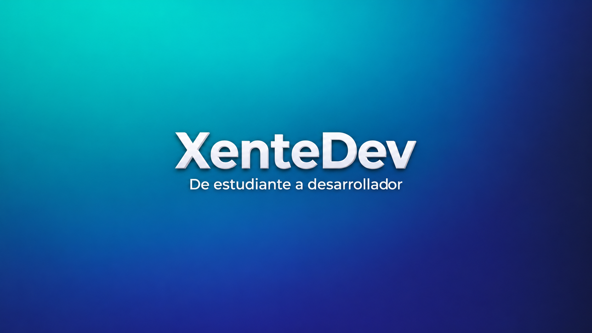

<div align="center">
  

  # ¡Hola, soy XenteDev! 👋
  
  **De estudiante a desarrollador.**  
  Documento mi ruta técnica, proyectos prácticos y flujos de trabajo con Inteligencia Artificial para acelerar el salto de las aulas al mercado laboral.

  [](https://www.youtube.com/@XenteDev)
  []()
</div>

---

### Lo que comparto en el canal y la comunidad

- 🚀 Contenido sobre DAW : qué esperar del ciclo, cómo abordar los módulos complejos y métodos de estudio para avanzar sin frustrarte.
- 🤖 IA Práctica para Estudiar y Trabajar: uso aplicado de herramientas de IA para asimilar conceptos difíciles, gestionar documentación y multiplicar tu productividad.
- 🧠 Mentalidad : preparación para tus primeras prácticas, errores comunes y como afrontarlos.

---

### 🛠️ Stack y Herramientas

```text
Backend:    Java | Spring Boot | PHP | Laravel
Frontend:   JavaScript | React | Tailwind CSS | HTML5 / CSS3
DevOps/OS:  Docker | Linux / Debian | Git & GitHub | Nginx
IA & Data:  NotebookLM | Gemini | ChatGPT | Python
